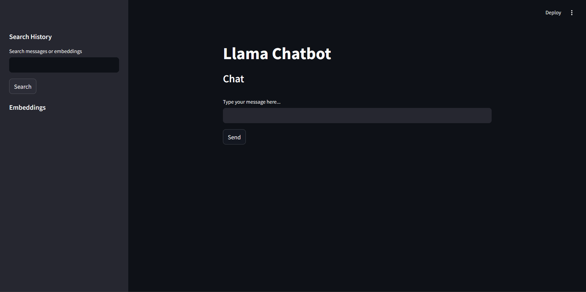
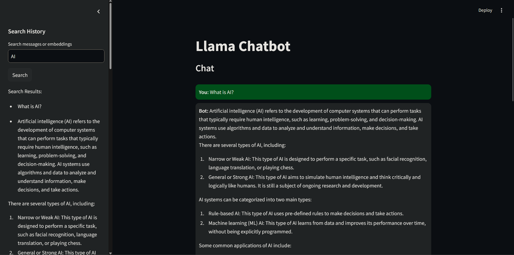
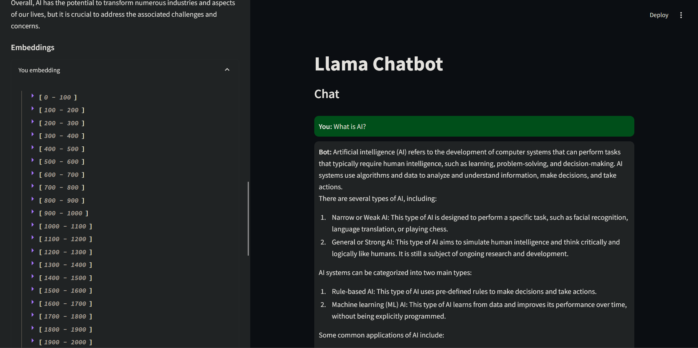
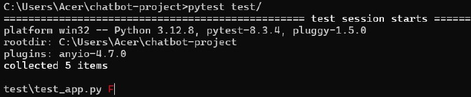
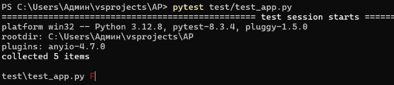

# Llama Chatbot: Streamlit & ChromaDB (〜￣▽￣)〜

A chatbot application powered by Streamlit for browser-based interaction, Ollama for LLM integration, and ChromaDB as a vector store for storing queries and embeddings.

## Installation

Follow the steps below to set up the project:

1. **Clone the Repository**:
    
    ```bash
    git clone <repository_url>
    cd <repository_directory>
    ```
    
2. **Set Up a Virtual Environment** (Optional but recommended):
    
    ```bash
    python -m venv env
    source env/bin/activate  # On Windows, use `env\Scripts\activate`
    ```
    
3. **Install Dependencies**:
    
    ```bash
    pip install -r requirements.txt
    ```
    
    Ensure the following packages are installed:
    
    - `streamlit`
    - `ollama`
    - `chromadb`
4. **Configure ChromaDB Storage**: Modify the `persist_directory` variable in the code to point to your desired storage location for ChromaDB.
    
5. **Set Up Ollama**: Ensure Ollama is configured and the `llama3.2:1b` model is available on your system.
    

## Usage

1. **Run the Application**:
    
    ```bash
    streamlit run app.py
    ```
    
2. **Access the Chat Interface**: Open the provided URL in your browser to interact with the chatbot.
    
3. **Chat with the Bot**:
    
    - Type your queries into the input field.
    - View responses from the bot and chat history in the main interface.
	
1. **Search History**: Use the sidebar to search stored messages and embeddings.
    

## Examples

### Chat Interaction

1. Type a message in the input field (e.g., "What is AI?") and click "Send."
2. The bot responds with a detailed answer.
3. Both the query and response are stored as embeddings in ChromaDB.



### Searching Chat History

1. Enter a search query in the "Search messages or embeddings" field in the sidebar.
2. Click "Search."
3. View matching results retrieved from ChromaDB.



### Viewing Embeddings

1. Expand the "Embeddings" section in the sidebar.
2. View detailed embeddings for user queries and bot responses.



## Features

- **Interactive Chat**: Seamless communication with the bot in a user-friendly interface.
- **Streamlit Interface**: Responsive and intuitive browser-based experience.
- **Embedding Generation**: Generate and store vector embeddings for all interactions using ChromaDB.
- **Search Capability**: Retrieve past messages or embeddings using semantic search.

## Testing

To ensure the application functions as expected, follow these steps to set up and run the tests:

1. **Ensure Correct Project Structure**:
    
    ```
    project_directory/
    ├── app.py                 # Main application code
    ├── test/                  # Folder for tests
    │   ├── test_app.py        # Test script
    │   └── test_data.json     # Test data
    ```
    
2. **Test Script (`test_app.py`)**: Ensure the `test_app.py` script contains the following code:
    
    ```python
    import json
    import pytest
    import sys
    import os
    
    # Add project directory to sys.path for importing app.py
    sys.path.append(os.path.abspath(os.path.join(os.path.dirname(__file__), '..')))
    from app import get_response  # Import function from app.py
    
    # Load test data
    with open(os.path.join(os.path.dirname(__file__), "test_data.json"), "r") as f:
        test_data = json.load(f)
    
    # Parametrize tests
    @pytest.mark.parametrize("test_case", test_data["tests"])
    def test_chatbot_responses(test_case):
        input_text = test_case["input"]
        expected_output = test_case["expected_output"]
    
        # Get bot response
        bot_output = get_response(input_text)
    
        # Verify the output matches the expected result
        assert bot_output == expected_output, f"Failed on input: {input_text}"
    ```
    
3. **Run Tests**: From the root directory of the project, run the following command:
    
    ```bash
    pytest test/test_app.py
    ```
    
4. **Verify Output**:
    
    - Successful test run:
        
        ```
        ============================= test session starts =============================
        collected 5 items                                                              
        
        test/test_app.py .....                                                   [100%]
        
        ============================== 5 passed in 0.42s ==============================
        ```
        
        
    - Failed test run:
        
        ```
        ============================= test session starts =============================
        collected 5 items                                                              
        
        test/test_app.py ...F.                                                   [80%]
        
        ================================== FAILURES ===================================
        __________________________ test_chatbot_responses _____________________________
        
        Failed on input: What is AI?
        
        AssertionError: Output 'Artificial intelligence...' does not match expected 'AI stands for Artificial Intelligence...'
        
        ============================ 1 failed, 4 passed ===============================
        ```
         
## License

This project is licensed under the MIT License. Feel free to use, modify, and distribute it as needed.
